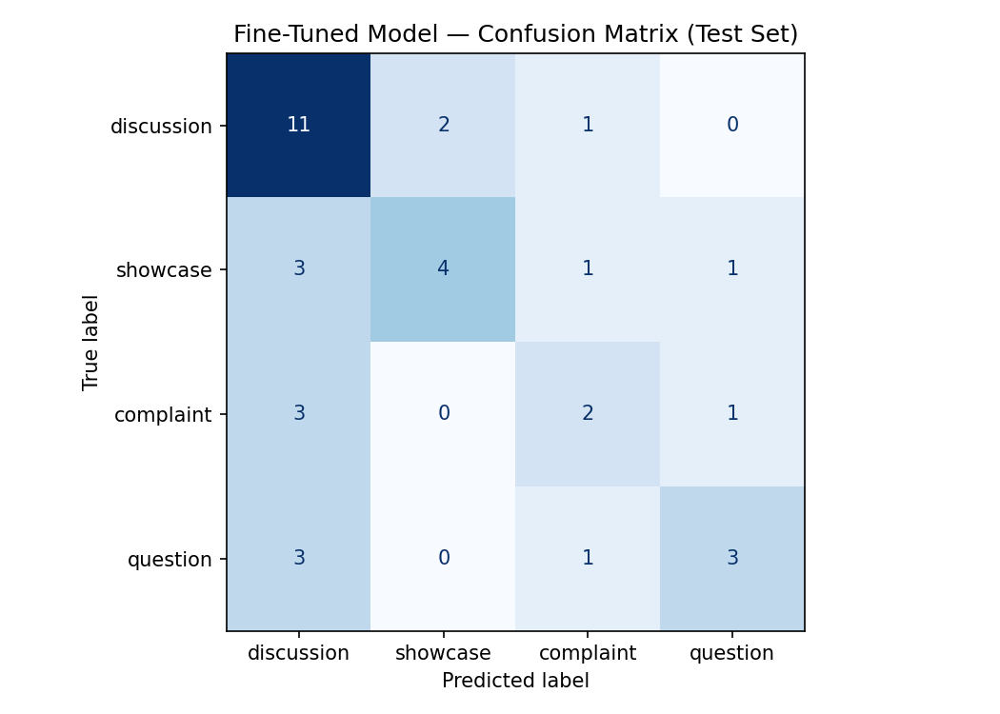

# takemeter

A fine-tuned DistilBERT classifier that sorts r/LeagueOfLegends posts into four discussion types: question, complaint, discussion, and showcase.

## Label Taxonomy

- **question** — asking for help, advice, or clarification (macro help, new player questions)
  - Example 1: How do you play around a team with poor macro?
  - Example 2: All football skins are back after 8 years. But why no sweeper rammus chromas available?
- **complaint** — balance issues, bugs, server problems, hitbox frustration
  - Example 1: Last hit indicator in ranked is a terrible addition
  - Example 2: north america server down
- **discussion** — opinions, design philosophy, meta debate
  - Example 1: Renekton JG
  - Example 2: Comparing Rek'Sai in lower & higher elo brackets
- **showcase** — sharing achievements, tools, resources, or highlights
  - Example 1: MVP T1 Miss Fortune will cost 1,820 RP for 3 patches. Then it will be in the rotating Mythic Shop for 150 Mythic Essence
  - Example 2: T1 Worlds Skins Splash Arts

**Hardest edge case:** 
- https://www.reddit.com/r/leagueoflegends/comments/1ubnv66/top_lane_sucks_how_can_i_carry_my_games/: this post could fall under complaint or question because the poster is doing both in one post. I decided to categorize this under question because the complaint being made is context for the question that the poster is asking. 
- https://www.reddit.com/r/leagueoflegends/comments/1ubpf4w/hit_plat_now_feel_flat/: this post could fall under complaint or question. It complains in the title about "feeling flat" but then ends the post with a question to the commmunity. I decided on labeling it discussion because of the final question directed at the community.
- https://www.reddit.com/r/leagueoflegends/comments/1udwgyi/why_the_last_hit_indicator_lowers_the_level_of/: this post's title makes it seem like a discussion post or a question post but the body reads like a complaint. I decided on labeling as a complaint because it doesn't ask a question to the community in the body. 

## Annotated Dataset

- **Source:** Reddit posts scraped from r/leagueoflegends, manually curated and labeled.
- **Labeling process:** The dataset was initially labeled with the help of Claude, then manually reviewed and corrected by hand — every post was read to confirm the label fit. Disagreements were resolved by re-reading the post and deciding on its primary intent.
- **Label distribution:** Total examples: 237

| Label | Count | % of dataset |
|---|---|---|
| question | 47 | 19.83% |
| complaint | 43 | 18.14% |
| discussion | 93 | 39.24% |
| showcase | 54 | 22.78% |

**Difficult examples:**
1. "What is going on this season? I had a teammate who had a huge ego saying he was peak masters so after the game i go to look at my teammates op.gg it says they peaked masters this season but now E1...." — Decision: labeled as **complaint** because the user is expressing frustration, but the model predicted **discussion**. This highlights the ambiguity between discussion and complaint when a personal grievance is shared in a narrative format.
2. "I cleaned up the attic and found 4x still working Riot Games Foam Thundersticks. I think i got them at the german Gamescom from 2012 or it was from an EU LCS event. Had to get out the old batteries..." — Decision: labeled as **showcase** because the user is sharing an item, but the model predicted **discussion**. The model may be misreading the nostalgic storytelling as general discussion rather than a presentation of a found item.
3. "My friends and I are Silver and Gold players but we have to play in Tier III because for some reason one of my friends (he peaked gold IV a few seasons ago) is placed Tier I. Now we get stomped by pla..." — Decision: labeled as **complaint** because the user is expressing frustration with the tiering system, but the model predicted **question**. The model may be picking up on the implicit "how to deal with this" framing, overlooking the core grievance.

## Fine-Tuning Pipeline

- **Base model:** distilbert-base-uncased
- **Training platform:** Google Colab with a T4 GPU runtime.
- **Key training decision:** Epochs were set to 5 (instead of the default 3) and the learning rate was adjusted to 3e-5 (from the standard 2e-5). These changes were made to let the model learn more from the small dataset while trying to avoid overfitting, based on initial experimentation.

## Baseline Comparison

- **Baseline approach:** For the baseline, I used zero-shot classification with a prompted Groq on the same 36-post test set used to evaluate the fine-tuned model. The model was given a system prompt that defined each of the four labels with a one-sentence description and one example post per label, then asked to output only the label name. No training data was shown to the model.
I ran two versions of the prompt. The second added tiebreaker rules to help distinguish complaint from discussion, but both scored nearly identically, so the final baseline uses the second version.
- **Results:** Baseline accuracy: 0.556 (evaluated on 36/36 parseable responses)

Per-class metrics (baseline):

| Label | Precision | Recall | F1 | Support |
|---|---|---|---|---|
| discussion | 0.57 | 0.29 | 0.38 | 14 |
| showcase | 0.89 | 0.89 | 0.89 | 9 |
| complaint | 0.17 | 0.17 | 0.17 | 6 |
| question | 0.50 | 1.00 | 0.67 | 7 |
| **accuracy** | | | **0.56** | 36 |
| **macro avg** | 0.53 | 0.59 | 0.53 | 36 |
| **weighted avg** | 0.57 | 0.56 | 0.53 | 36 |

## Evaluation Report and Error Analysis

**Per-class metrics (fine-tuned model):** accuracy 0.556

| Label | Precision | Recall | F1 | Support |
|---|---|---|---|---|
| discussion | 0.55 | 0.79 | 0.65 | 14 |
| showcase | 0.67 | 0.44 | 0.53 | 9 |
| complaint | 0.40 | 0.33 | 0.36 | 6 |
| question | 0.60 | 0.43 | 0.50 | 7 |
| **accuracy** | | | **0.56** | 36 |
| **macro avg** | 0.55 | 0.50 | 0.51 | 36 |
| **weighted avg** | 0.56 | 0.56 | 0.54 | 36 |

**Fine-tuned vs. baseline (same test set):**

| Model | Accuracy |
|---|---|
| Zero-shot baseline (Groq) | 0.556 |
| Fine-tuned DistilBERT | 0.556 |

Fine-tuning improvement: 0.000

**Confusion matrix:**

**Wrong prediction analysis:**
1. "What is going on this season? I had a teammate who had a huge ego saying he was peak masters so after the game i go to look at my teammates op.gg it says they peaked masters this season but now E1...."  
True: complaint
Predicted: discussion (confidence: 0.40) 
Explanation: the model struggles to differentiate a personal grievance (complaint) from a general discussion, especially when the complaint is told as a narrative.
2. "I cleaned up the attic and found 4x still working Riot Games Foam Thundersticks. I think i got them at the german Gamescom from 2012 or it was from an EU LCS event. Had to get out the old batteries..." 
True: showcase
Predicted: discussion (confidence: 0.41) 
Explanation: the model appears to misread nostalgic sharing of an object as general discussion, possibly because the item itself prompts conversation.
3. "My friends and I are Silver and Gold players but we have to play in Tier III because for some reason one of my friends (he peaked gold IV a few seasons ago) is placed Tier I. Now we get stomped by pla..." 
True: complaint
Predicted: question (confidence: 0.43) 
Explanation: the model has trouble distinguishing a complaint about a system from a question about how to navigate it, likely picking up on the implied problem-solving angle over the core frustration.

**Reflection — gap between intended and captured behavior:** 
Both the fine-tuned model and the baseline struggled significantly with the complaint label, often confusing it with discussion or question. This suggests the nuanced distinction between expressing a grievance (complaint) and inviting general discussion or asking a question while frustrated is a key area where both models fail.

## AI Usage and Spec Reflection

**AI tool use:**
1. I asked Claude to help me label the 200+ scraped reddit posts. I reviewed the labels and read every post to double check if the label was accurate or not. I made several changes as a result and noted any edge cases.

2. I asked Claude to help me identify trends in the mislabled output. It identified two major patterns: complaint -> discussion issue and showcase -> discussion issue. I further identified that it was mislabling question posts that sound like discussions or complaints. No changes were made to Claude's initial output.

**Spec reflection:** Having to report per-class metrics instead of just accuracy actually helped me catch that the model was bad at complaint specifically, not just "bad overall". As for diverging from my plan, in planning.md I said I wanted macro F1 >= 0.75, but I only got around 0.51 with basically no improvement over the baseline. I didn't go back and change that target after seeing the real results, I just left it and reported the gap, since I think that gap is more useful for the error analysis than a target that matches what I actually got.

